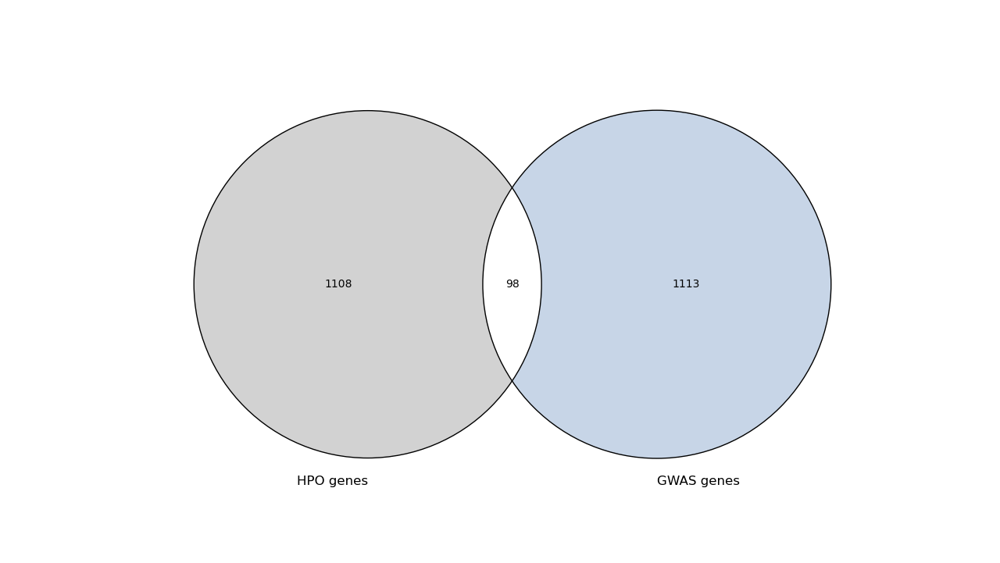

## Description 
* * *

The scripts located in this directory can be used to perform a fisher's exact test on the results of a gene prioritization method to find out if the prioritized genes are enriched for genes that are associated with a relevant HPO term. Additionaly, venn diagrams displaying the overlap between genes for the specified HPO term and prioritized genes produced by the gene prioritization method will be produced([example](#venn-diagram)).


## Getting Started
* * *
To be able to perform the fisher exact tests on the results of a gene prioritization method we need to run the [fisher_exact_test.py](fisher_exact_test.py) script. This script can process multiple results from different traits at the same time, which should be set in the configuration file.

This script has the option to either save the results or plot/print them using the `-s` and `-p` flags. 

Example:
```bash
python fisher_exact_test_prio_methods.py -c config.yaml -m NetWAS -o results/ -s
```

> NOTE: use the `-h` argument to get the help message

### Requirements

* configuration file
    * Results of the prioritization method + relevant HPO term
    * HPO data
* Name of the prioritization method

### Config file

```yaml
traits:
  Height: 
    file: "/path/to/height_results.txt"
    hpo_term: 'HP:0000002'
  IBD: 
    file: "/path/to/IBD_results.txt"
    hpo_term: 'HP:0012649'
  PrC: 
    file: "/path/to/prstcan_results.txt"
    hpo_term: 'HP:0002664'

hpo_data: "/path/to/hpo_database.txt.gz"
```

## Venn Diagram
* * *

This is an example of a venn diagram which was produced for the results of NetWAS for the GWAS trait height using `'HP:0000002'` as a HPO term:

