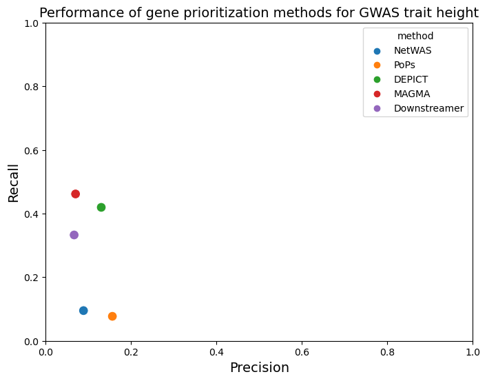
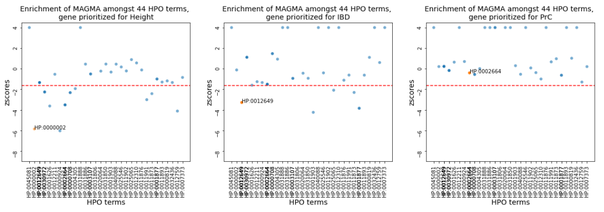

## Description 
* * *
This notebook is used to produce all the plots that were used for the paper. It uses a configuration file to supply all the data.

## Getting Started
* * *
To produce all the results the configuration file needs to be filled in correctly and then the notebook should be ran from top to bottom.

### Configuration File
The configuration file contains the results of the multiple fisher exact tests for each trait produced by [`results/fisher_tests/fisher_exact_test_prio_methods.py`](../../results/fisher_tests/fisher_exact_test_prio_methods.py) script, the results of the gene prioritization methods for each trait and the location of the HPO data.

Example: 

```yaml
results_methods:
  Height:
    NetWAS: "path/to/height_netwas_ensembl.csv"
    PoPs: "path/to/gene_output_height.preds"
    Depict: "path/to/HeightSNPs_5e8_01_1000kb_200_geneprioritization.txt"
    MAGMA: "path/to/gene_output_height.genes.out"
    Downstreamer: "path/to/height_2018_30124842_hg19_enrichtments.xlsx"
  IBD:
    NetWAS: "path/to/ibd_netwas_ensembl.csv"
    PoPs: "path/to/gene_output_IBD.preds"
    Depict: "path/to/IBD_5e8_1000kb_r2_01_geneprioritization.txt"
    MAGMA: "path/to/gene_output_IBD.genes.out"
    Downstreamer: "path/to/inflammatory_bowel_disease_2017_29906448_hg19_enrichtments.xlsx"
  PrC:
    NetWAS: "path/to/prostate_netwas_ensembl.csv"
    PoPs: "path/to/gene_output_prstcan.preds"
    Depict: "path/to/PC_5e8_1000kb_r2_01_geneprioritization.txt"
    MAGMA: "path/to/gene_output_prstcan.genes.out"
    Downstreamer: "path/to/prostate_cancer_2018_29892016_hg19_enrichtments.xlsx"

results_fisher:
  Height:
    NetWAS: "path/to/fisher_result_height_netwas_ensembl.csv"
    PoPs: "path/to/fisher_result_gene_output_height.csv"
    Depict: "path/to/fisher_result_HeightSNPs_5e8_01_1000kb_200_geneprioritization.csv"
    MAGMA: "path/to/fisher_result_gene_output_height.genes.csv"
    Downstreamer: "path/to/fisher_result_height_2018_30124842_hg19_enrichtments.csv"
  IBD:
    NetWAS: "path/to/fisher_result_ibd_netwas_ensembl.csv"
    PoPs: "path/to/fisher_result_gene_output_IBD.csv"
    Depict: "path/to/fisher_result_IBD_5e8_1000kb_r2_01_geneprioritization.csv"
    MAGMA: "path/to/fisher_result_gene_output_IBD.genes.csv"
    Downstreamer: "path/to/fisher_result_inflammatory_bowel_disease_2017_29906448_hg19_enrichtments.csv"
  PrC:
    NetWAS: "path/to/fisher_result_prostate_netwas_ensembl.csv"
    PoPs: "path/to/fisher_result_gene_output_prstcan.csv"
    Depict: "Cpath/to/fisher_result_PC_5e8_1000kb_r2_01_geneprioritization.csv"
    MAGMA: "path/to/fisher_result_gene_output_prstcan.genes.csv"
    Downstreamer: "path/to/fisher_result_prostate_cancer_2018_29892016_hg19_enrichtments.csv"


hpo_data: "path/to/HPO_data.txt.gz"
```

## Example Images



